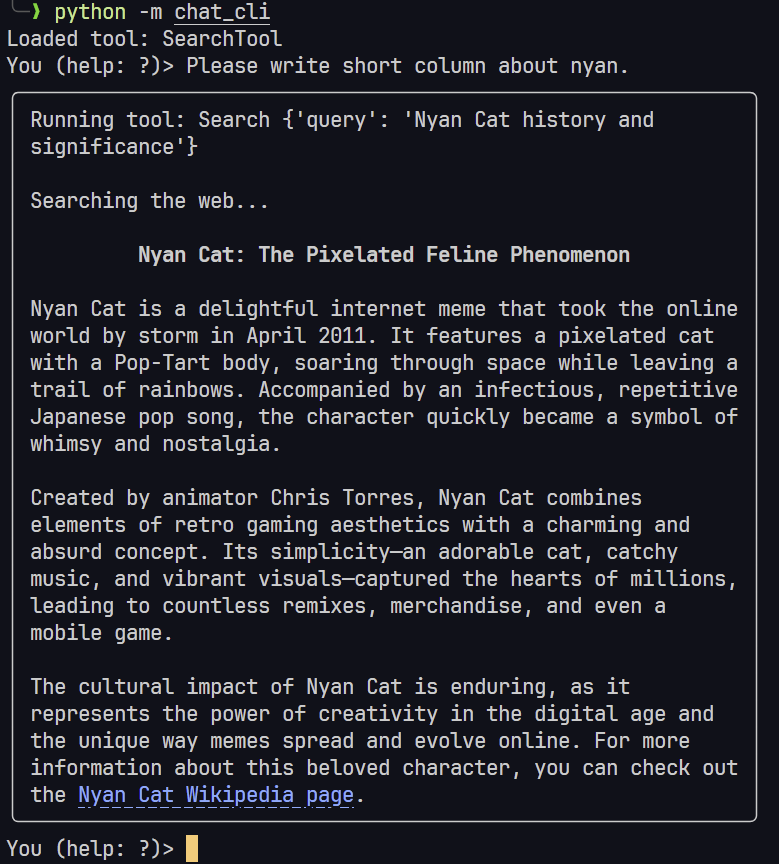

# Chat CLI

The Chat CLI is a command-line interface for interacting with OpenAI's models in a structured chat format. This tool allows users to manage multiple chat sessions and switch between different models and tools seamlessly.

## Features

- **Multiple Sessions**: Create and manage multiple chat sessions.
- **Realtime Response**: All LLM responses are displayed in real-time.
- **Toggle Tools**: Enable or disable tools within a session.
- **Change Model**: Switch to a different OpenAI model for the session.
- **Rich Output**: Markdown in responses is rendered in the terminal. (with `rich`)
- **Auto-Complete**: Press Tab for auto-completion of commands, session IDs. (with `prompt-toolkit`)

## Screenshot(s)



## Installation

1. **Clone the Repository**:

   ```sh
   git clone <repository-url>
   cd <repository-directory>
   ```

2. **Install Poetry**:
   If you don't have Poetry installed, you can install it using the following command:

   ```sh
   curl -sSL https://install.python-poetry.org | python3 -
   ```

3. **Install Dependencies**:
   Use Poetry to install the required dependencies:

   ```sh
   poetry install
   ```

4. **Create a `.env` File**:
   Create a `.env` file in the root directory and add your OpenAI API key:

   ```sh
   OPENAI_API_KEY=your_openai_api_key
   ```

## Usage

To run the Chat CLI with Poetry:

1. **Activate the Poetry Shell**:

   ```sh
   poetry shell
   ```

2. **Run the CLI**:

   ```sh
   poetry run python -m chat_cli
   ```

   Enter `?` to see the list of available commands.
   Or press Tab for auto-completion.

(Optional) To run the main script directly:

   ```sh
   poetry run main
   ```

### Command Overview

- `?` - Show this help
- `n` - New conversation
- `l` - List conversations
- `s` - Select conversation
- `d` - Delete conversation
- `t` - Toggle tools
- `tl` - List loaded tools
- `m` - Change model
- `q` - Quit

### Example Session

```sh
You (help: ?)> n
Created new session: 123e4567-e89b-12d3-a456-426614174000
You (help: ?)> Hello, how are you?
<OpenAI Response>
You (help: ?)> l
Available sessions:
  * 123e4567-e89b-12d3-a456-426614174000 (current)
You (help: ?)> s
Available sessions:
  * 123e4567-e89b-12d3-a456-426614174000 (current)
Enter the session ID to select: 123e4567-e89b-12d3-a456-426614174000
Switched to session: 123e4567-e89b-12d3-a456-426614174000
You (help: ?)> q
```

## Contributing

We welcome contributions! Here are some ways you can help:

- Report bugs and issues
- Suggest features
- Submit pull requests with improvements

## License

This project is licensed under the MIT License. See the `LICENSE` file for details.
